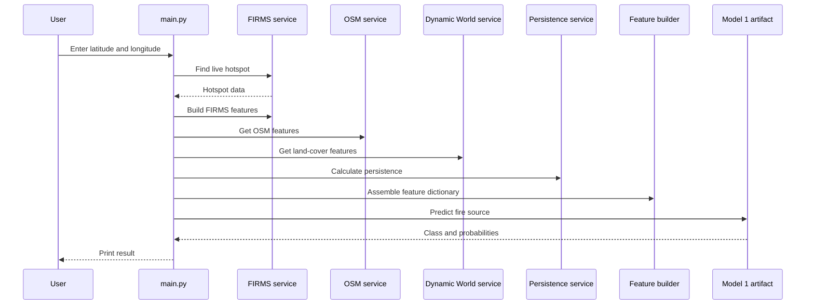
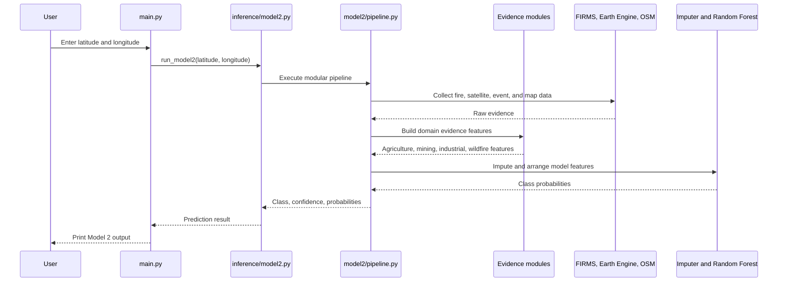

# Fire Detection Project Architecture

## System Overview

```mermaid
flowchart TD
    USER[User enters latitude and longitude] --> MAIN[backend/main.py]
    ENV[FIRE_MODEL environment variable] --> MAIN
    MAIN --> SELECT{Selected model?}

    SELECT -->|FIRE_MODEL=1| M1[Model 1 workflow]
    SELECT -->|FIRE_MODEL=2| M2[Model 2 workflow]

    subgraph MODEL1[Model 1: Fire Source Classification]
        M1 --> LOAD1[backend/inference/model1.py]
        LOAD1 --> PACKAGE1[models/model1/model_package.joblib]
        M1 --> FIRMS[backend/services/firms.py]
        M1 --> OSM1[backend/services/osm.py]
        M1 --> DW1[backend/services/dynamic_world.py]
        M1 --> PERSIST[backend/services/persistence.py]
        FIRMS --> FEATURES1[backend/services/feature_builder.py]
        OSM1 --> FEATURES1
        DW1 --> FEATURES1
        PERSIST --> FEATURES1
        FEATURES1 --> PREDICT1[Model 1 prediction]
        PACKAGE1 --> PREDICT1
    end

    subgraph MODEL2[Model 2: Modular Fire Source Prediction]
        M2 --> INFER2[backend/inference/model2.py]
        INFER2 --> PIPE[backend/services/model2/pipeline.py]
        PIPE --> CONFIG2[model2/config.py]
        PIPE --> EVENTS[model2/events.py]
        PIPE --> FEATURES2[model2/features.py]
        PIPE --> EVIDENCE[model2/evidence.py]
        PIPE --> SOURCE[model2/source_evidence.py]
        EVENTS --> FIRMS2[model2/firms.py]
        EVENTS --> FLARE[model2/flare.py]
        EVENTS --> HISTORY[model2/history.py]
        EVENTS --> TEMP[model2/temporal.py]
        EVIDENCE --> AGRI[model2/agriculture.py]
        EVIDENCE --> INDUSTRIAL[model2/industrial.py]
        EVIDENCE --> MINING[model2/mining.py]
        EVIDENCE --> WILDFIRE[model2/wildfire.py]
        FEATURES2 --> DW2[model2/dynamic_world.py]
        FEATURES2 --> OSM2[model2/osm.py]
        PIPE --> IMPUTER[models/model2/production_imputer.joblib]
        PIPE --> RF[models/model2/production_random_forest.joblib]
        PIPE --> COLUMNS[models/model2/feature_columns.csv]
        IMPUTER --> RF
        COLUMNS --> RF
        FEATURES2 --> RF
        RF --> PREDICT2[Class, confidence, probabilities]
    end

    FIRMS --> NASA[NASA FIRMS API]
    FIRMS2 --> NASA
    FLARE --> NASA
    DW1 --> GEE[Google Earth Engine]
    DW2 --> GEE
    OSM1 --> OSMAPI[OpenStreetMap / Overpass API]
    OSM2 --> OSMAPI
    PREDICT1 --> OUTPUT[Console output]
    PREDICT2 --> OUTPUT
```



## Directory Structure

```mermaid
flowchart TD
    ROOT[FIRE_DETECTION_MODEL]
    ROOT --> BACKEND[backend/]
    ROOT --> DATA[data/]
    ROOT --> MODELS[models/]
    ROOT --> NOTEBOOKS[notebooks/]
    ROOT --> TESTS[tests/]
    ROOT --> SCRIPTS[scripts/]
    ROOT --> DOCS[docs/]

    BACKEND --> MAIN[main.py]
    BACKEND --> CONFIG[config.py]
    BACKEND --> INFERENCE[inference/]
    BACKEND --> SERVICES[services/]
    BACKEND --> SCHEMAS[schemas/]

    INFERENCE --> MODEL1PY[model1.py]
    INFERENCE --> MODEL2PY[model2.py]

    SERVICES --> GENERAL[General services]
    SERVICES --> MODULAR[services/model2/]
    GENERAL --> FIRMSPY[firms.py]
    GENERAL --> OSMPY[osm.py]
    GENERAL --> DYNAMICPY[dynamic_world.py]
    GENERAL --> FEATURESPY[feature_builder.py]
    GENERAL --> PERSISTPY[persistence.py]

    MODULAR --> PIPELINE[pipeline.py]
    MODULAR --> EVENTSPY[events.py]
    MODULAR --> EVIDENCEPY[evidence.py]
    MODULAR --> FEATURESMOD[features.py]
    MODULAR --> DOMAIN[agriculture, industrial, mining, wildfire]
    MODULAR --> SUPPORT[history, temporal, flare, OSM, Dynamic World]

    MODELS --> MODEL1DIR[model1/]
    MODELS --> MODEL2DIR[model2/]
    MODEL1DIR --> PACKAGE[model_package.joblib]
    MODEL2DIR --> RF[random forest joblib]
    MODEL2DIR --> IMPUTER[production imputer joblib]
    MODEL2DIR --> COLUMNS[feature columns CSV]

    DATA --> CSV[Training and evidence CSV files]
    NOTEBOOKS --> TRAINING[Model training notebooks]
    TESTS --> CHECKS[Unit and integration tests]
    SCRIPTS --> TESTSCRIPT[test_models.py]
```



## Model 1 Runtime Flow



## Model 2 Runtime Flow



## Responsibilities

| Layer | Responsibility |
| --- | --- |
| `backend/main.py` | Reads input, selects Model 1 or Model 2, and prints results. |
| `backend/inference/` | Loads model artifacts and exposes prediction functions. |
| `backend/services/` | Collects external data and builds Model 1 features. |
| `backend/services/model2/` | Runs the modular Model 2 evidence and feature pipeline. |
| `models/` | Stores trained models, imputers, and feature-column definitions. |
| `data/` | Stores training outputs and evidence datasets. |
| `notebooks/` | Contains exploratory analysis and model-training notebooks. |
| `tests/` | Contains unit and integration checks. |
| `scripts/` | Contains executable validation utilities. |

## External Data Sources

- NASA FIRMS: active fire and hotspot observations.
- Google Earth Engine: Dynamic World and satellite-derived land-cover data.
- OpenStreetMap / Overpass: nearby roads, buildings, industrial areas, mines, and other geographic context.

## Running the Models

```bash
# Model 1
FIRE_MODEL=1 python3 -m backend.main

# Model 2
FIRE_MODEL=2 python3 -m backend.main
```

Model 1 requires `NASA_FIRMS_MAP_KEY`. Model 2 may require the configured Earth Engine project and external API access, depending on the enabled feature collectors.